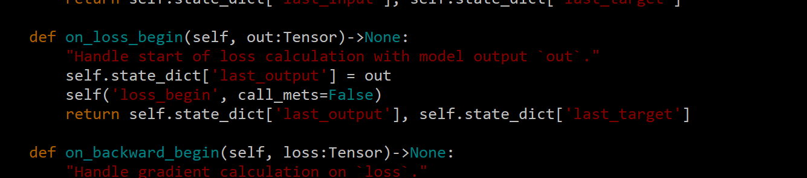
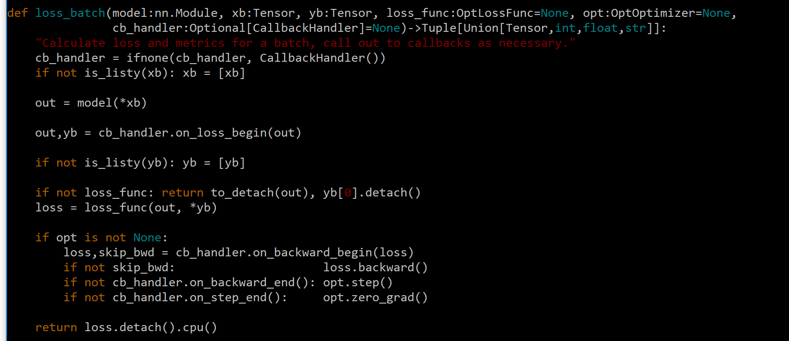

# RotationNet
fastai implementation of RotationNet

Read all about this project at: https://medium.com/@mathis.alex/rotationnet-in-fast-ai-adventures-in-virtual-set-creation-and-computer-vision-cd694ad7ec1b

<b>Contents:</b>

<b>makeDataSubSet.py</b> - creates a smaller dataset for quicker training and iteration.

<b>rotationNet-fastai-MIRO.ipynb</b> - jupyter notebook that trains and predicts using the MIRO dataset.

<b>rotationNet-fastai.ipynb</b> - jupyter notebook that trains and predicts using the ModelNet40 dataset.

<b>rotationNet-expansion</b> - added a new chair class to the MIRO dataset and uses resnet18 as the backbone. Best results: 96.07% class prediction accuracy, 77.32% pose estimate accuracy, 92.01% pose "precision" (pose estimate was only one rotation off from gt).

<b>rNCallbacks.py</b> - needed during inference when using a saved model. Called by startPredictors.py.

<b>startPredictors.py</b> - script that needs to be running in the background when using Unreal for inference.

See https://github.com/kanezaki/pytorch-rotationnet for the official PyTorch implementation of the paper and instructions on how to download and setup the MIRO and ModelNet datasets.

Note: Because of RotationNet's specific requirements I had to change a few lines in fast.ai's source code. RotationNet needs further processing on the target tensor before calculating loss, so in <b>callback.py</b> I updated the 'last_target' entry of the state dictionary when the callback handler calls "on_loss_begin":

 

In <b>basic_train.py</b> I changed the loss_batch function so that the target tensor gets updated at the same time as the CNN output, right before loss calculation:

 

